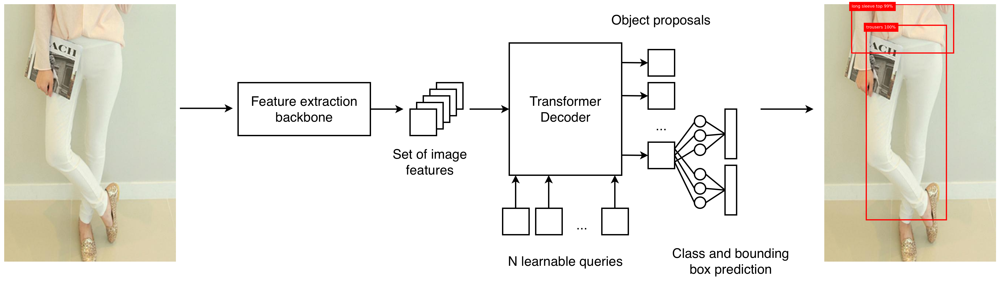
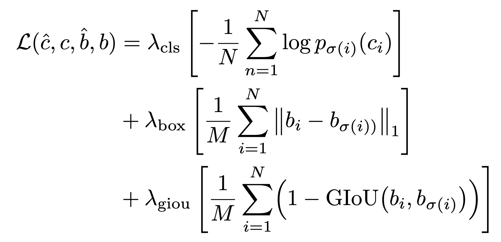
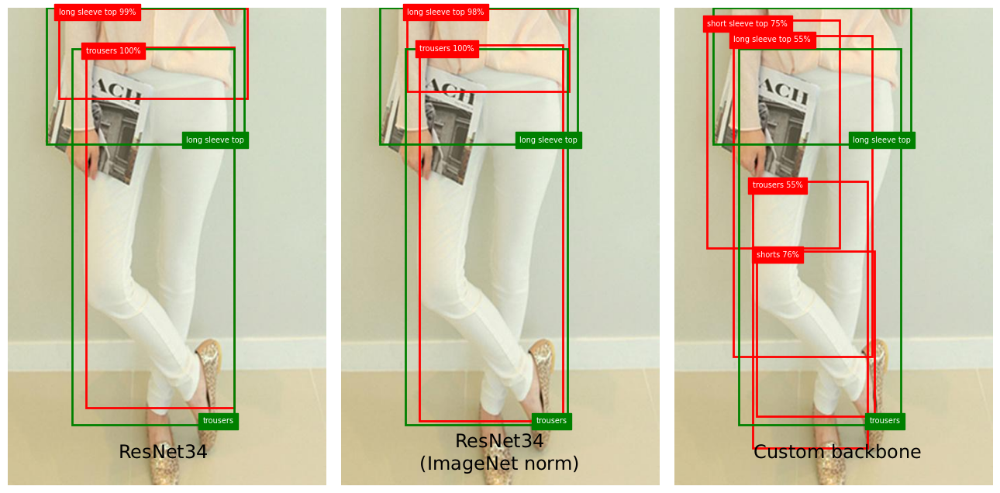
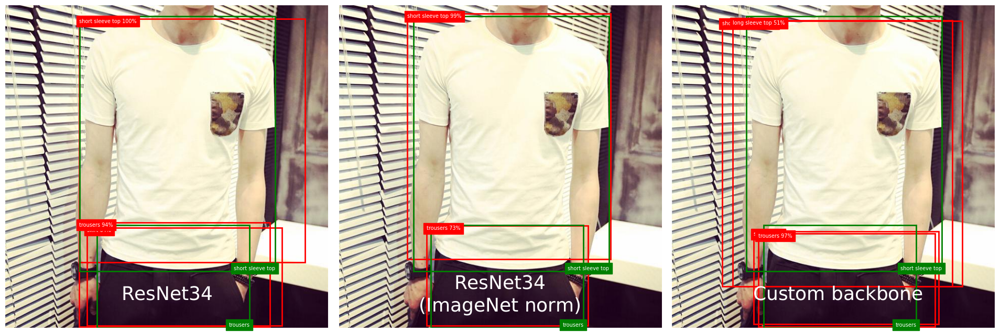
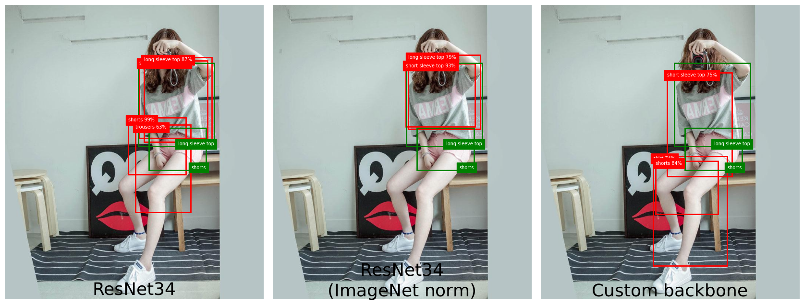
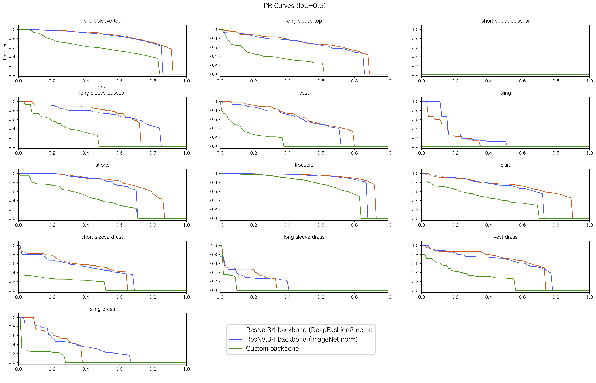
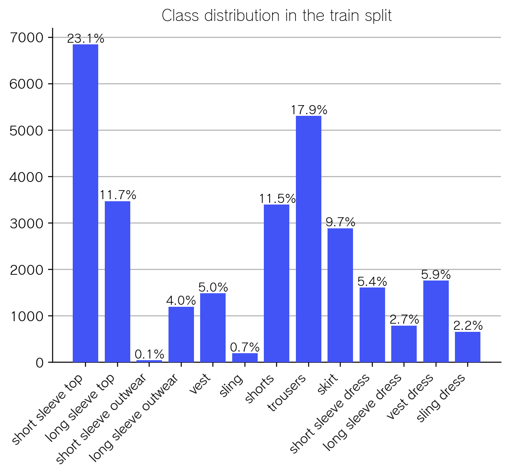

# Multi-object detection with Hungarian matching-based loss

This is a toy project to implement a [DETR](https://github.com/facebookresearch/detr)-style object detector, using a set-based loss with the [Hungarian algorithm](https://en.wikipedia.org/wiki/Hungarian_algorithm) for the problem of bipartite matching: we can see the output detections and the ground truth boxes as nodes of a bipartite graph, and compute a loss cost based on the best matching.

For this project I chose the [DeepFashion2](https://github.com/switchablenorms/DeepFashion2) dataset, limiting the detection to the clothes class and bounding box. Compared to other more common object detection datasets, this dataset presents high similarity between objects of different classes. Due to resource limitations, only a small subset of the dataset was used. The files ```train_indexes.txt``` and ```test_indexes.txt``` contain the filenames of the images used from that dataset.

## Model architecture

The model is loosely based on DETR, with a **feature extraction backbone** and a **Decoder-based query proposal** part (DETR uses a full transformer for the query proposal).

The learnable queries are fed into the Decoder, together with the features extracted by the backbone as memory. The outputs of the Decoder are processed through one MLP for the bounding box regression and a FC layer for the class detection.

Three backbones were used in the experiments:
- ResNet34 with ImageNet normalization of the images
- ResNet34 with normalization using DeepFashion2's mean and std
- A toy backbone involving a simple CNN and a MultiHeadAttention layer

Both resnets use pretrained weights from ImageNet.




## Loss function

The loss function follows DETR's implementation: the Hungarian algorithm is used to match each GT element with the most similar query (with a cost based on the class, the IoU between the boxes and the MAE between the box center coordinates, height and width). The final loss is:




## Result analysis


### Qualitative analysis

The following images show the behavior of the three backbones on random images from the test subset. The GT boxes are drawn in green, while the inferences are in red; only the inferences with at least 50% certainty score are drawn.







Both the ResNet34 backbones behave well and focus on meaningful parts of the image. In the second image, the first backbone detects an additional "skirt" item on top of the trousers. The double detection is also present in the third image, where the model detects "shorts" and "trousers", probably because of the similar color of the shorts compared to the girl's skin tone. Both models also detect a "short sleeve top" and a "long sleeve top", probably because those two classes are not well separated in the training data.



The custom backbone detects many more items in each image compared to the other two backbones, albeit with a lower score in average. The boxes are also not well aligned with the clothes. This shows the importance of having a good feature extractor as backbone.


### Metrics

The following images show the precision-recall curves for each class and the sample distribution for each class in the training split of the dataset. By comparing the two, it clearly appears that the classes for which the model struggles the most are the least represented in the train set (short sleeve outwear, sling, long sleeve dress, sling dress), all of which have less than 1000 samples. The "short sleeve dress" and "vest dress" classes have between 1000 and 2000 samples, and it can clearly be seen that the curve tail before the decay is longer, meaning that with at least 1000 sampels, the models can learn significant features to recognize those classes.

Out of the three models, the two ResNets behave similarly, although the ResNet trained with DeepFashion2's norm has a better P-R tradeoff for the more represented classes, while the ResNet that uses ImageNet's norm work better for the other classes. As expected, the custom backbone falls off quickly, remarking once again the importance of having a good feature extractor.





This table shows the mAP by class, and the overall mAP and mAP@0.5. Again, the metrics suffer from the poor perfomance on the least represented classes.

| Class mAP            | ResNet | ResNet (ImageNet norm) | Custom |
|----------------------|:------:|:----------------------:|:------:|
| short sleeve top     | 0.494  |          0.391         | 0.271  |
| long sleeve top      | 0.377  |          0.322         | 0.135  |
| short sleeve outwear | 0.000  |          0.000         | 0.000  |
| long sleeve outwear  | 0.323  |          0.322         | 0.124  |
| vest                 | 0.310  |          0.250         | 0.073  |
| sling                | 0.094  |          0.085         | 0.000  |
| shorts               | 0.460  |          0.329         | 0.200  |
| trousers             | 0.556  |          0.497         | 0.392  |
| skirt                | 0.388  |          0.316         | 0.201  |
| short sleeve dress   | 0.257  |          0.248         | 0.070  |
| long sleeve dress    | 0.099  |          0.077         | 0.031  |
| vest dress           | 0.330  |          0.329         | 0.119  |
| sling dress          | 0.175  |          0.165         | 0.051  |
|**Total:**                                                       |
| mAP                  | 0.297  |          0.256         | 0.128  |
| mAP@0.5              | 0.498  |          0.477         | 0.245  |


## Final considerations

For this project I only used a small portion of the actual DeepFashion2 dataset (21k images vs the ~500k of the whole dataset); moreover, because of resource costraints I could only test a small backbone, but it would be interesting to test bigger backbones (e.g. ResNet101 or Vision Transformers) and include the auxiliary losses used in DETR's training procedure at each Decoder layer. I also implemented a learnable loss weighting from [this paper](https://arxiv.org/abs/1705.07115), but didn't use it in the final training procedure; it would be worth comparing the final perfomances using it vs. different static weights for the loss components.
