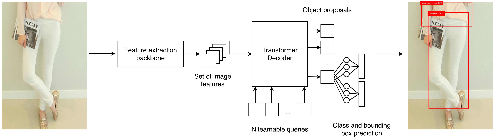
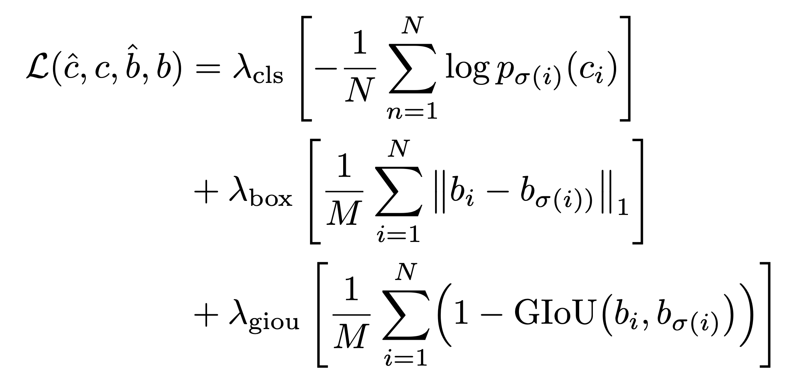
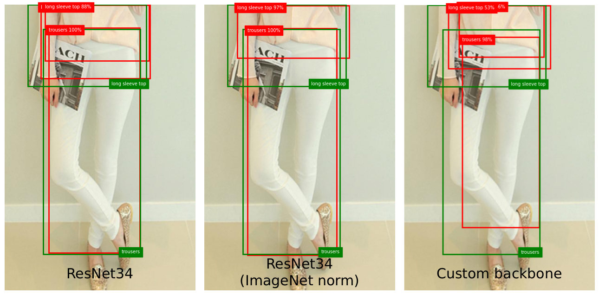
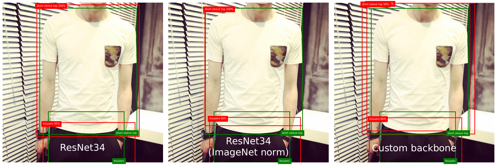
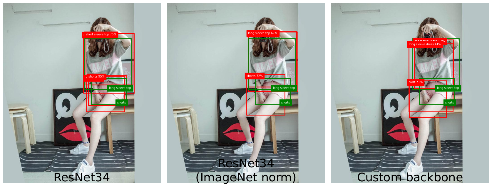
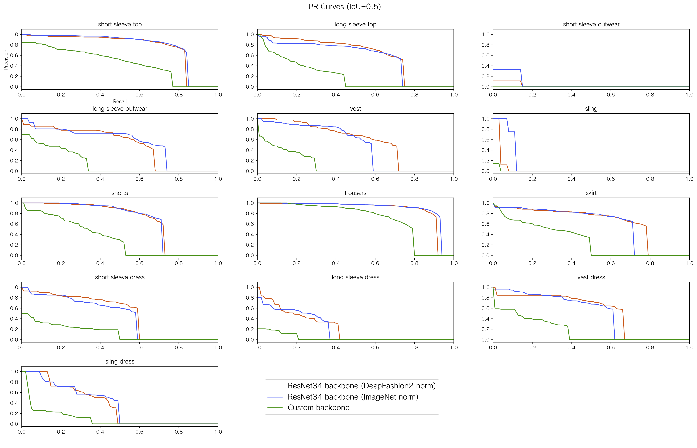
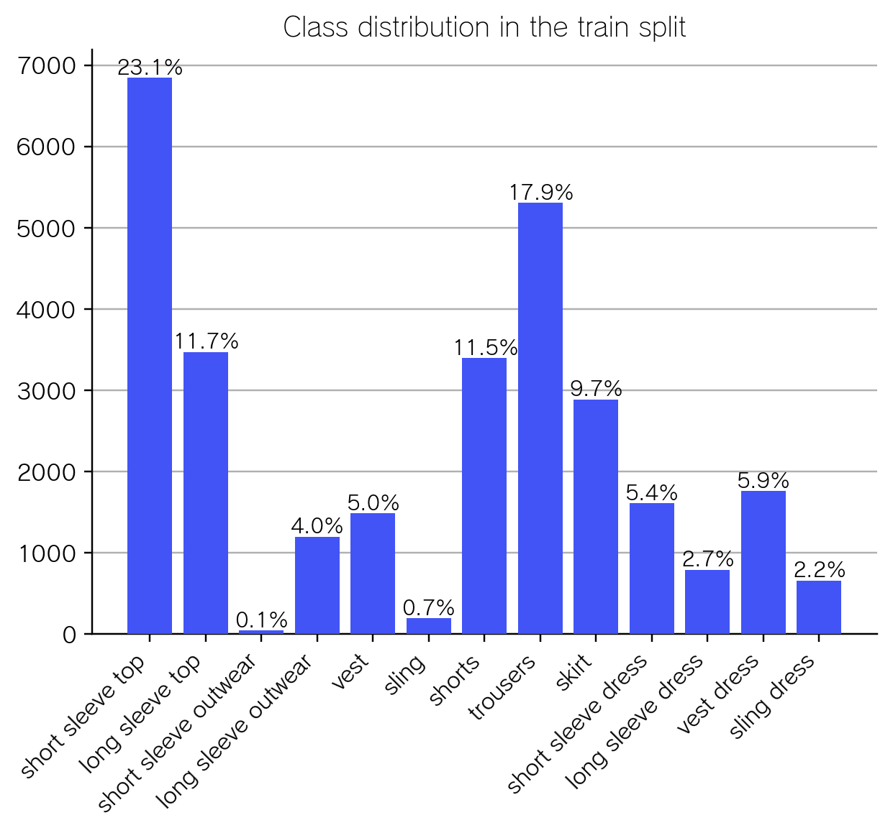
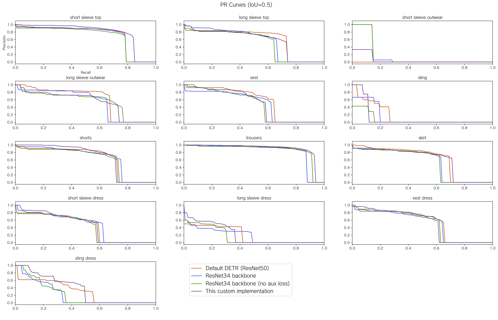

# Multi-object detection with Hungarian matching-based loss

This is a toy project to implement a [DETR](https://github.com/facebookresearch/detr)-style object detector, using a set-based loss with the [Hungarian algorithm](https://en.wikipedia.org/wiki/Hungarian_algorithm) for the problem of bipartite matching: we can see the output detections and the ground truth boxes as nodes of a bipartite graph, and compute a loss cost based on the best matching.

For this project I chose the [DeepFashion2](https://github.com/switchablenorms/DeepFashion2) dataset, limiting the detection to the clothes class and bounding box. Compared to other more common object detection datasets, this dataset presents high similarity between objects of different classes. Due to resource limitations, only a small subset of the dataset was used. The files ```train_indexes.txt``` and ```test_indexes.txt``` contain the filenames of the images used from that dataset.

## Model architecture

The model is loosely based on DETR, with a **feature extraction backbone** and a **Decoder-based query proposal** part (DETR uses a full transformer for the query proposal).

The learnable queries are fed into the Decoder, together with the features extracted by the backbone as memory. The outputs of the Decoder are processed through one MLP for the bounding box regression and a FC layer for the class detection.

Three backbones were used in the experiments:
- ResNet34 with ImageNet normalization of the images
- ResNet34 with normalization using DeepFashion2's mean and std
- A toy backbone involving a simple CNN and a MultiHeadAttention layer

Both resnets use pretrained weights from ImageNet.




## Loss function

The loss function follows DETR's implementation: the Hungarian algorithm is used to match each GT element with the most similar query (with a cost based on the class, the IoU between the boxes and the MAE between the box center coordinates, height and width). The final loss is:




## Result analysis


### Qualitative analysis

The following images show the behavior of the three backbones on random images from the test subset. The GT boxes are drawn in green, while the inferences are in red; only the inferences with at least 50% certainty score are drawn.







Both the ResNet34 backbones behave well and focus on meaningful parts of the image. In the first image, the first backbone detects an the "long sleeve top" twice, but with slightly different boxes. The double detection is also present in the third image, where the model detects "shorts" twice, once with a box that is very close the to ground truth, and the secon time with a larger box, probably because of the similar color of the shorts compared to the girl's skin tone. Both models also detect a "short sleeve top" and a "long sleeve top", probably because those two classes are not well separated in the training data.



The custom backbone detects many more items in each image compared to the other two backbones, albeit with a lower score in average. The boxes are also not well aligned with the clothes. This shows the importance of having a good feature extractor as backbone.


### Metrics

The following images show the precision-recall curves for each class and the sample distribution for each class in the training split of the dataset. By comparing the two, it clearly appears that the classes for which the model struggles the most are the least represented in the train set (short sleeve outwear, sling, long sleeve dress, sling dress), all of which have less than 1000 samples. The "short sleeve dress" and "vest dress" classes have between 1000 and 2000 samples, and it can clearly be seen that the curve tail before the decay is longer, meaning that with at least 1000 sampels, the models can learn significant features to recognize those classes.

Out of the three models, the two ResNets behave similarly, although the ResNet trained with DeepFashion2's norm has a better P-R tradeoff for the some classes, while the ResNet that uses ImageNet's norm works better for the two least represented classes (short sleeve outwear and sling). As expected, the custom backbone falls off quickly, remarking once again the importance of having a good feature extractor.





This table shows the mAP by class, and the overall mAP and mAP@0.5. Again, the metrics suffer from the poor perfomance on the least represented classes. It is important to note that these metrics are also influenced by the parameter initialization, which in this case was not fixed (my bad I guess, also for reproducibility). A better comparison would require multiple training experiments with different initializations and then averaging the resulting metrics; however, these numbers can still give a rough idea of the strenghts and weaknesses of each backbone, and how effective the whole model is for this task.

| Class mAP            | ResNet | ResNet (ImageNet norm)  | Custom      |
|:--------------------:|:------:|:-----------------------:|:-----------:|
| short sleeve top     | 0.522  |          0.516          |    0.234    |
| long sleeve top      | 0.347  |          0.337          |    0.096    |
| short sleeve outwear | 0.013  |          0.0347         |    0.0      |
| long sleeve outwear  | 0.303  |          0.317          |    0.078    |
| vest                 | 0.332  |          0.306          |    0.062    |
| sling                | 0.035  |          0.089          |    0.005    |  
| shorts               | 0.390  |          0.388          |    0.155    |
| trousers             | 0.545  |          0.554          |    0.361    |
| skirt                | 0.396  |          0.382          |    0.157    |
| short sleeve dress   | 0.349  |          0.326          |    0.083    |
| long sleeve dress    | 0.162  |          0.150          |    0.022    |
| vest dress           | 0.358  |          0.352          |    0.1      |  
| sling dress          | 0.244  |          0.253          |    0.061    |
|**Total:**                                                             |
| mAP                  | 0.307  |          0.308          |    0.109    |
| mAP@0.5              | 0.477  |          0.472          |    0.208    |


## Comparison with the original DETR

There are some small differences between this implementation and Facebook's original DETR, namely the image preprocessing (here I downsample images to a size of 224x224, while DETR resizes at multiple scales, and keeps the original aspect ratio). Another difference is that DETR uses a full Transformer with 6 Encoder and 6 Decoder layers after the feature extraction backbone, while we only use 4-layer Decoder. The main impact these differences make are the inference speed, which is naturally lower on this implementation, and possibly the model's precision, since smaller objects are more easily recognizable in bigger images.

The following image shows a comparison between the PR curves of several DETR variations trained from scratch on this dataset, and my implementation trained with the ImageNet norm (see table above). Because of hardware limitations, I decided to also train the DETR models with the fixed image size of 224x224, so the plots do not tell how much benefit the models take form the multi-scale training schedule (or if there is at all), but we can still make some considerations on the tradeoff between having a full Transformer or just a smaller Decoder for query extraction.



Surprisingly, we can see that there is not much difference between the various models. The default DETR (with the ResNet50 backbone) generally performs better (as expected), and my implementation is somewhat similar to the DETR model with the same ResNet34 backbone and no auxiliary losses used during training, even though my model is much smaller (around 24M parameters compared to 39M), so *for this particular training setting and amount of data*, using only the Decoder instead of the full Transformer (and reducing the layer count) is actually a better choice, as it is similarly good in terms of precision, but much faster (my model achieves around 18 fps of pure inference speed on the M1 Pro with Metal Shader, while DETR with a ResNet34 backbone achieves 8 fps, but take these numbers with a grain of salt).

This table shows the mAP for the models in the plot:
|                 Model                  |  mAP  |  mAP@0.5  |
|:--------------------------------------:|:-----:|:---------:|
| Default DETR                           | 0.322 |   0.466   |
| DETR w/ ResNet34 backbone              | 0.300 |   0.452   |
| DETR w/ ResNet34 backbone, no aux loss | 0.289 |   0.437   |
| This implementation                    | 0.308 |   0.472   |

To train DETR on DeepFashion2, take a look at the `README.md` in the folder `detr_comparison`.


## Final considerations

For this project I only used a small portion of the actual DeepFashion2 dataset (21k images vs the ~500k of the whole dataset); moreover, because of resource costraints I could only test a small backbone, but it would be interesting to test bigger backbones (e.g. ResNet101 or Vision Transformers) and include the auxiliary losses used in DETR's training procedure at each Decoder layer. I also implemented a learnable loss weighting from [this paper](https://arxiv.org/abs/1705.07115), but didn't use it in the final training procedure; it would be worth comparing the final perfomances using it vs. different static weights for the loss components.

## Citation

If you found this project interesting and would like to use it, please cite it as below:

```
@software{Bazzana2025HungarianLoss,
  author       = {Bazzana, Lorenzo},
  title        = {Multi-object Detection with Hungarian Matching-Based Loss},
  version      = {1.0.0},
  year         = {2025},
  month        = dec,
  date         = {2025-12-16},
  url          = {https://github.com/lorenzobazzana/Object-detection-with-Hungarian-loss},
  note         = {ORCID: 0009-0001-9727-7019}
}
```

## Bibliography

[DETR](https://github.com/facebookresearch/detr) - Carion, N., Massa, F., Synnaeve, G., Usunier, N., Kirillov, A., & Zagoruyko, S. (2020). End-to-end object detection with transformers (arXiv:2005.12872). arXiv. https://arxiv.org/abs/2005.12872

[DeepFashion2](https://github.com/switchablenorms/DeepFashion2) - Ge, Y., Zhang, R., Wu, L., Wang, X., Tang, X., & Luo, P. (2019). A versatile benchmark for detection, pose estimation, segmentation and re-identification of clothing images. Proceedings of the IEEE/CVF Conference on Computer Vision and Pattern Recognition (CVPR).